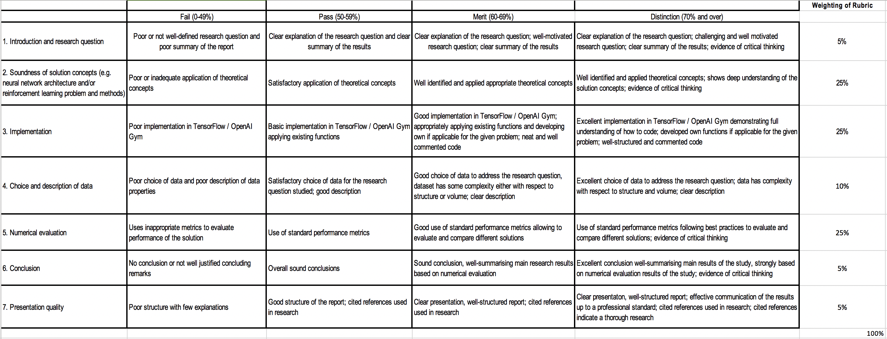

# Generating Synthetic Data Using Generative Adversarial Networks
--------------------------------------------------------------------------------------------------------------------
### ST449 Course Project | 21 May 2020 | Candidate Number: 34445

Final report:

- [Final Report PDF](GeneratingSyntheticData-DeepLearning-21My2020-FinalReport.pdf)

Supplementary Code in [code](code):
    
- GAN model classes that are used for training: [models.py](code/models.py)
        
- Evaluation functions that are used for evaluation: [evaluation_functions.py](code/evaluation_functions.py) 
        
Explanatory Notebooks in [notebooks](notebooks)
        
- [Training Notebook](notebooks/Training_Notebook.ipynb) demonstrates how models were trained.
        
- [Evaluation Notebook](notebooks/Evaluation_Notebook.ipynb) demonstrates how models were evaluated.

- [Plots Notebook](notebooks/Plots_Notebook.ipynb) demonstrates how plots were created.

-----------------------------------------------------------------------------------------------------------------------

This is the repository for the course project – please keep anything project related in this repository.

 

**Project Deadline: 30th April 2020, 5 pm London time.**

## PROJECT: Generating Synthetic Data Using GANs

## PROBLEM: 
There are two main motivations for generating synthetic data. First, it can increase utility of data that contains valuable information but is not available publicly due to confidentiality issues. This is often the case in health care where data has patient identifiable information and, therefore, restricted access. By enabling broader use of synthetic datasets with similar statistical properties as real data, more experts can analyse the data and contribute solutions to key problems. 

Second, in many situations, training effective ML models requires representative data that may not be readily available. Synthetic data can be used to augment training data and improve ML model performance on test data.

## OBJECTIVES:
Our aim is to explore the use of generative adversarial networks (GANs) to create synthetic data that has similar statistical properties to the original data. If effective, this method may be used to work on problems with confidential data. 
Besides considering statistical properties of generated data, we also test its effectiveness for training ML models. We observe the performance of ML models trained purely with the synthetic data and compare them with the ML models trained on original data. 

In all our evaluations, we use a range of GAN configurations and evaluate them in the context of the two scenarios described above: comparing statistical properties or performance of ML models. We consider discrete variables which add a challenge to the data generation process. In particular, the GAN training process is complicated because the loss function cannot be used straightforwardly to update the GAN parameter values since backpropagation is not possible due to the discreteness of the generator output. For that reason, we approximate the discrete generation output with the gumbel-softmax function which offers the continuity that is needed. 
I
n the final report, we describe the method in detail and discuss the experiment results. 

## DATA:
*	Categorical dataset: Simulacrum dataset, https://simulacrum.healthdatainsight.org.uk/
    -	The Simulacrum dataset: this is itself a synthetic dataset generated using from the cancer tumour dataset held by Public Health England. The methods used to generate Simulacrum are different from the ones that we apply.
    - Contains around 1,500,000 tumour-patient records that are made up of categorical variables.
*	Before training the GAN model, the categorical data variables are transformed into one-hot coded vectors.

## METHODS:
Categorical:
*	Specific initial GAN designs include three layers for the generator and one layer for the discriminator, as was done in the paper 'Generating Multi-Categorical Samples with Generative Adversarial Networks'. Each layer is a dense layer with batch normalization and relu activation function. The output of the generator consists of a dense layer and gumbel-softmax activation layer for each variable. The outputs of the activation layers across variables are concatenated into a single vector that represents the final generator output. 
*	We may consider the use of autoencoders as in medGAN paper: https://arxiv.org/abs/1703.06490.

GAN designs comprises:
*	Generator network
    -	Consists of a simple feedforward network 
    -	Categorical: the final one dense layer for each of the categorical variables in the data, followed by a gumbel-softmax activation layer. This is a continuous approximation of a discrete distribution and allows for backpropagation when training the generator.
*	Discriminator network:
    -	Final sigmoid activation to guess if inputs are real or fake
*	Loss functions
    -	Binary cross-entropy.
    - Can consider the Wasserstein distance
*	Assessment of the GAN models, aiming at the desirable properties:
Characterizing the probability distributions of variables  
ML model performance metrics (accuracy, AUC, etc.). 

## References:
-	Generating Multi-Categorical Samples with Generative Adversarial Networks
    - Ramiro D. Camino, Christian A. Hammerschmidt, Radu State, 2018
    - https://arxiv.org/pdf/1807.01202.pdf 
-	Generating Multi-label Discrete Patient Records using Generative Adversarial Networks (MedGAN)
    - https://arxiv.org/abs/1703.06490
-	The Concrete Distribution: A Continuous Relaxation of Discrete Random Variables
    - Chris J. Maddison, Andriy Mnih, Yee Whye The
    - https://arxiv.org/abs/1611.00712
-	Discrete Data Tricks:
    - https://duvenaud.github.io/learn-discrete/
-	Categorical Reparameterization with Gumbel-Softmax
    - Eric Jang, Shixiang Gu, Ben Poole, 2016
    - https://arxiv.org/abs/1611.01144
-	Data Augmentation Using GANs
    - Fabio Henrique Kiyoiti dos Santos Tanaka, Claus Aranha, 2019
    - https://arxiv.org/pdf/1904.09135.pdf
-	Generating Differentially Private Datasets Using GANs 
    - Anonymous, under review, 2018
    - https://openreview.net/pdf?id=rJv4XWZA-
-	GANS for Sequences of Discrete Elements with the Gumbel-softmax Distribution
    - Matt Kusner, José Miguel Hernández-Lobato, 2016
    - https://arxiv.org/pdf/1611.04051.pdf

## Notes

* [MV - April 27, 2020] Approved. Sounds interesting!

## Marking criteria

 

## Candidate topics

[Project.md](https://github.com/lse-st446/lectures2020/blob/master/Projects.md)

 
